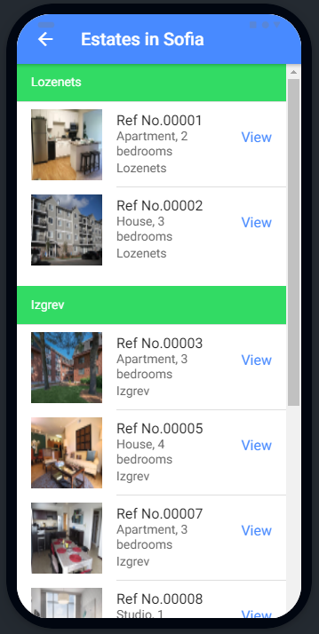

# Royal Estates App
An Ionic mobile application, which enables users to easily search, preview and save, estates organized in different locations and regions and having different properties.
Mobile apps course project repo.

# Screenshots

